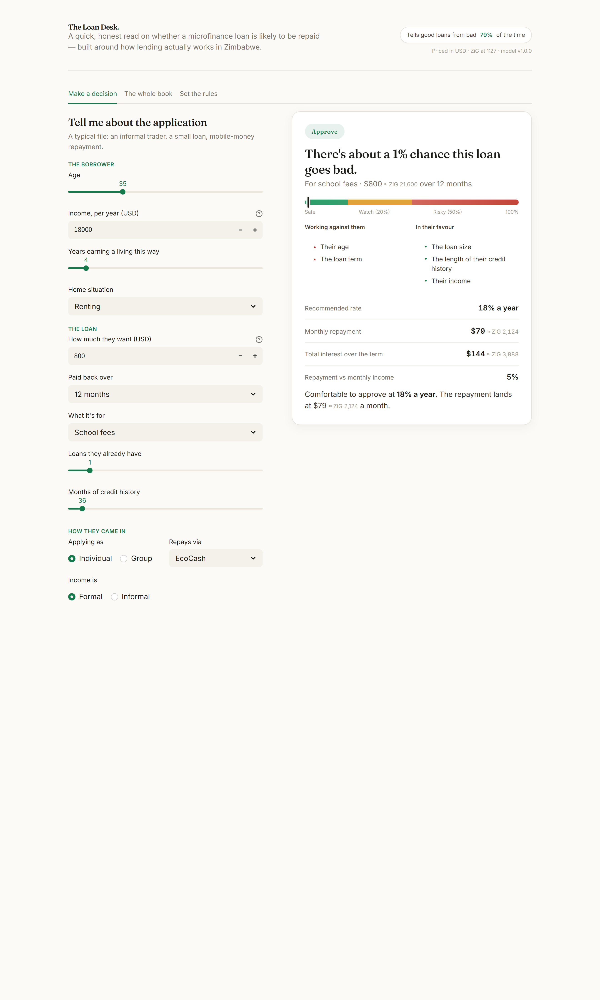
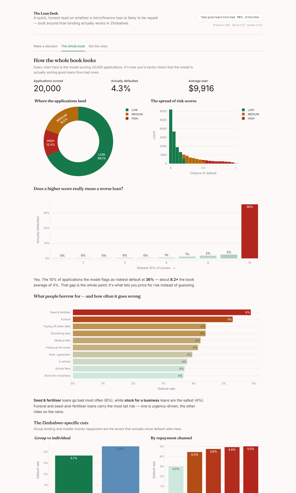
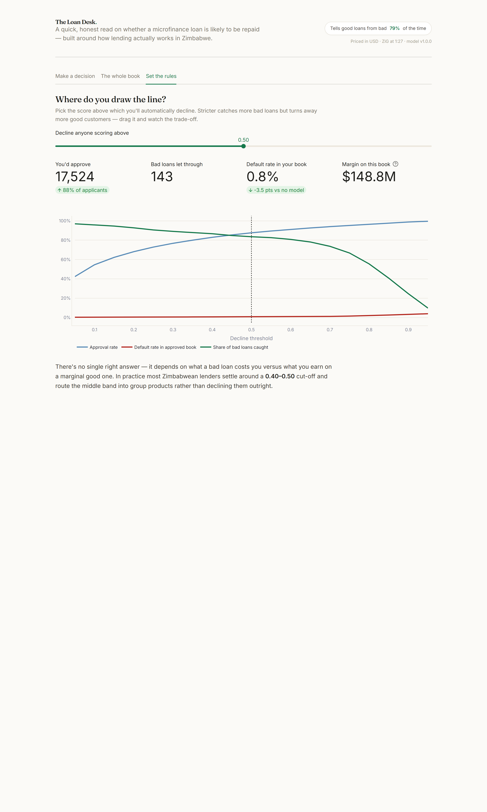

<div align="center">


<a href="https://github.com/nanettetada">

</a>

<p>


</p>

<a href="https://microfinance-credit-risk.streamlit.app/"></a>

</div>

---

## :dart: Why I built this

Most ML tutorials end with a Jupyter cell that prints an accuracy number and call it done. I wanted to know what it actually takes to turn a model into something a team could run in production — so I built reproducible training, a served model, a test suite, a Docker container, *and* an analytics dashboard, all wired together.

I also gave the dataset a **Zimbabwean microfinance** flavour: loan purposes include **school fees** (the three-term cycle every Zim parent knows), **agricultural inputs** for smallholder farmers, **funeral assistance**, **solar backup** for load-shedding, and **business capital**. Home ownership includes the **LODGER** status that's much more common here than a US-style mortgage. The risk model is calibrated against those realities.

The front end is **The Loan Desk** — a single, clean decision screen where a loan officer fills in an application and immediately sees a verdict, the reasons behind it in plain English, and a recommended offer. No jargon, no wall of tabs.

## The dashboard

<table>
  <tr>
    <td width="50%" valign="top">
      <p align="center"><b>Make a decision</b><br/><sub>Verdict, the reasons behind it, and a recommended offer — live as you type</sub></p>
      
    </td>
    <td width="50%" valign="top">
      <p align="center"><b>The whole book</b><br/><sub>Score distribution, the lift chart, default rates by purpose and Zim-specific cuts</sub></p>
      
    </td>
  </tr>
  <tr>
    <td colspan="2" valign="top">
      <p align="center"><b>Set the rules</b><br/><sub>Drag the decline threshold and watch approval rate, default rate, and margin move together</sub></p>
      
    </td>
  </tr>
</table>

## :sparkles: At a glance

|  |  |
|---|---|
| **Problem** | Predict the probability that a Zim microfinance loan will default |
| **Approach** | XGBoost in a leakage-proof pipeline; `scale_pos_weight` for imbalance |
| **Loan purposes** | School fees · agric inputs · funeral · medical · business · car · home improvement · solar backup |
| **Serving** | FastAPI with Pydantic v2 validation; `/predict`, `/predict/batch`, `/health`, `/model/info` |
| **Quality** | 12 pytest tests including API smoke tests via TestClient |
| **Packaging** | Dockerfile + docker-compose |
| **Analytics** | "The Loan Desk" — a decision screen, book-level analytics, and a policy simulator |
| **Results** | ROC-AUC **0.79**, KS **0.45**, and the riskiest score decile defaults ~**8×** more than the book average |

## :building_construction: Architecture

```
       Raw / synthetic data
                 |
                 v
       src/data.py        load + validate + train/val/test split
                 |
                 v
       src/features.py    ColumnTransformer pipeline (leakage-proof)
                 |
                 v
       src/train.py       XGBoost + MLflow tracking -> models/*.joblib
                 |
       +---------+---------+
       |                   |
       v                   v
   api/main.py     dashboard.py
   FastAPI         Streamlit
       |                   |
       v                   |
   Docker container        |
       |                   |
       +---------+---------+
                 |
                 v
            Stakeholders
```

## :computer: Quick start

```bash
# Install
pip install -r requirements.txt -r requirements-dev.txt

# Train the model
python -m src.train

# Serve the API
uvicorn api.main:app --reload

# Or run the dashboard
streamlit run dashboard.py
```

## :test_tube: Hit the API

```bash
curl -X POST http://localhost:8000/predict \
  -H "Content-Type: application/json" \
  -d '{"age": 35, "income": 65000, "loan_amount": 15000, "loan_term_months": 36, "employment_years": 5, "credit_history_months": 84, "existing_loans": 1, "home_ownership": "OWN", "purpose": "DEBT_CONSOLIDATION"}'
```

```json
{
  "default_probability": 0.087,
  "risk_band": "LOW",
  "model_version": "1.0.0"
}
```

## :whale: Docker

```bash
docker-compose up
```

Open [http://localhost:8000/docs](http://localhost:8000/docs) for the auto-generated Swagger UI.

## :white_check_mark: Tests

```bash
pytest -v
```

The suite covers:
- Data generator produces valid shapes and types
- Train/val/test split has no overlapping rows
- The preprocessor handles unseen categories at inference time
- The model loads and predicts on a single applicant and a batch
- A risky application scores higher than a safe one
- The API returns 200 for valid input, 422 for invalid input

## :tv: The Loan Desk

Three plain-English sections:
- **Make a decision** — fill in an application and immediately get a verdict (approve / take a closer look / decline), the chance of default in plain words, a risk bar, the factors working for and against the borrower, and a recommended rate + monthly repayment (in USD with ZiG context).
- **The whole book** — risk-band breakdown, score distribution, the lift chart (does a higher score really mean a worse loan?), default rate by loan purpose, and the Zimbabwe-specific cuts: group vs individual lending and repayment channel.
- **Set the rules** — drag a decline threshold and watch approval rate, the default rate in the approved book, the share of bad loans caught, and the book's margin all move together.

The dashboard reads the model directly via `src.predict`, so it works even when the FastAPI service isn't running.

## :file_folder: Project layout

```
microfinance-credit-risk/
├── README.md
├── requirements.txt
├── requirements-dev.txt
├── Dockerfile
├── docker-compose.yml
├── Makefile
├── dashboard.py
├── src/
│   ├── data.py
│   ├── features.py
│   ├── train.py
│   └── predict.py
├── api/
│   ├── main.py
│   └── schemas.py
├── tests/
│   ├── conftest.py
│   ├── test_features.py
│   ├── test_predict.py
│   └── test_api.py
└── models/
```

## :rocket: What I'd add next

- Replace the synthetic dataset with a real one (LendingClub or Home Credit Default Risk) and re-tune.
- Add a probability calibration step (Platt or isotonic) and re-check the Brier score.
- A simple drift monitor that compares the live feature distribution against the training distribution.

---

<div align="center">


Built by <b>Tadaishe Maumbe</b> · <a href="https://github.com/nanettetada">@nanettetada</a> · <a href="mailto:maumbetadaishe@gmail.com">email</a>

</div>
